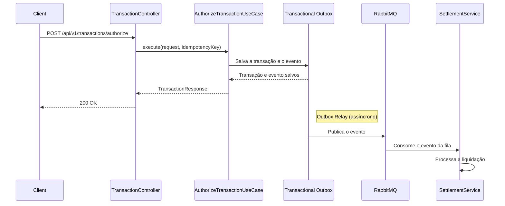

# OrionPay Merchant Service 🚀

Este é o microserviço central da plataforma de pagamentos **OrionPay**, responsável pela gestão de lojistas, processamento de transações, controle financeiro (Ledger), liquidação e resiliência.

Construído com **Java 21**, **Spring Boot 3.x** e seguindo os princípios de **Arquitetura Hexagonal (Ports & Adapters)** e **Domain-Driven Design (DDD)**.

---

## 🏗️ Arquitetura

O projeto segue uma arquitetura limpa, separando o núcleo de negócio das tecnologias externas.

---

## 🌊 Fluxo da Transação

O fluxo de uma transação é projetado para ser robusto e resiliente, garantindo a consistência dos dados e a capacidade de recuperação em caso de falhas.

### Diagrama do Fluxo



### Etapas do Fluxo

1.  **Requisição**: O cliente (PDV, e-commerce, etc.) envia uma requisição `POST` para o endpoint `/api/v1/transactions/authorize` com os dados da transação e um `X-Idempotency-Key` no cabeçalho.
2.  **Controlador**: O `TransactionController` recebe a requisição e chama o caso de uso `AuthorizeTransactionUseCase`.
3.  **Caso de Uso**: O `AuthorizeTransactionUseCase` orquestra a lógica de negócio para autorizar a transação.
4.  **Transactional Outbox**: A transação e um evento de domínio (ex: `TransactionAuthorizedEvent`) são salvos na mesma transação do banco de dados. Isso garante que o evento só será publicado se a transação for bem-sucedida.
5.  **Resposta**: O caso de uso retorna uma `TransactionResponse` para o controlador, que por sua vez responde ao cliente com um `200 OK`.
6.  **Publicação Assíncrona**: Um processo em segundo plano (Outbox Relay) monitora a tabela de outbox e publica os eventos pendentes no RabbitMQ. Isso garante que os eventos sejam entregues pelo menos uma vez (at-least-once delivery).
7.  **Consumo do Evento**: O `SettlementService` consome o evento da fila do RabbitMQ e inicia o processo de liquidação da transação.

### Consumidor do Evento: `SettlementService`

O `SettlementService` é o responsável por consumir o `TransactionEvent` e orquestrar a liquidação da transação. Suas principais responsabilidades são:

*   **Cálculo de Parcelas**: Decompõe a transação em parcelas, calculando o valor líquido e a data de vencimento de cada uma.
*   **Registro no Ledger**: Interage com o `LedgerIntegrationService` para registrar os lançamentos contábeis correspondentes a cada parcela.
*   **Resiliência**: Utiliza o padrão Circuit Breaker para lidar com falhas de comunicação com o Ledger, garantindo que a transação não seja perdida.
*   **Idempotência**: Garante que a mesma transação não seja processada mais de uma vez.

---

## ✨ Funcionalidades e Otimizações de Elite

### 1. Pattern Transactional Outbox (Consistência Eventual Garantida) 🛡️
Para garantir que nenhuma venda aprovada deixe de ser liquidada, implementamos o padrão **Transactional Outbox**.
*   **Funcionamento**: A venda e o evento de liquidação são salvos na **mesma transação** do banco de dados (Tabela `core.outbox`). Um componente **Outbox Relay** assíncrono publica no RabbitMQ com garantia **At-Least-Once**.

### 2. Idempotência Lógica e Mecanismo de Cura (Check-and-Skip) 🔄
Implementamos uma estratégia de idempotência multicamada para máxima integridade financeira.
*   **Check-and-Skip**: O motor de liquidação consulta o estado da parcela antes de processar. Se já estiver em estado final (`SCHEDULED`, `PAID`, etc.), a operação é ignorada, silenciando logs de erro de concorrência.
*   **Mecanismo de Cura**: Caso uma parcela exista no status `PENDING` (devido a falhas anteriores no Ledger), o motor tenta completar o processamento contábil para o registro existente, em vez de criar um novo.

### 3. Circuit Breaker e Bulkhead (Resiliência de Integração) 🔌
Proteção do fluxo crítico de liquidação contra falhas em cascata utilizando **Resilience4j**.
*   **Isolamento (Bulkhead)**: Limita o número de threads simultâneas em chamadas ao Ledger, evitando que lentidões consumam todos os recursos da JVM.
*   **Disjuntor (Circuit Breaker)**: Interrompe chamadas ao Ledger se a taxa de erro ultrapassar 50%.
*   **Fallback Inteligente**: Durante instabilidades, o sistema mantém as parcelas em estado `PENDING` no banco, permitindo a recuperação automática posterior sem descartar a transação.

### 4. Gestão de Exceções e Clean Logs 📋
Refatoração do tratamento de erros para facilitar a operação e o suporte (SRE).
*   **BusinessResilienceException**: Exceção customizada para sinalizar falta de configuração (MDR ou Conta). Bloqueia rollbacks totais e permite que o rascunho (`PENDING`) seja salvo para auditoria.
*   **Logs Acionáveis**: Substituição de StackTraces genéricos por mensagens claras de INFO/WARN em casos de idempotência e falhas de rede.

### 5. Motor de Liquidação e Orquestração de Parcelas 💳
*   **Explosão de Parcelas**: Transações de Crédito Parcelado são decompostas em múltiplos recebíveis na tabela `ops.settlement_entry`.
*   **D+30 Progressivo**: Cálculo automático de datas de vencimento mensais sincronizadas para o lojista.

### 6. Antecipação de Recebíveis com Precisão Bancária 💰
*   **Simulação e Execução**: Cálculo de custo de antecipação pro-rata baseado na taxa real do lojista e dias restantes para liquidação (D+N).
*   **Liquidez Imediata**: Crédito instantâneo no saldo disponível via Ledger ao realizar a operação.

---

## 🛠️ Tecnologias Principais
*   **Java 21** & **Spring Boot 3.x**
*   **RabbitMQ**: Mensageria e eventos.
*   **PostgreSQL**: Banco de dados relacional.
*   **Redis**: Cache e locks de idempotência.
*   **Resilience4j**: Circuit Breaker, Bulkhead e Retry.
*   **Micrometer/Prometheus**: Observabilidade e métricas de resiliência.

---

## 🚀 Como Rodar

### Pré-requisitos
*   Java 21 JDK, Maven e Docker.

### Executando a Aplicação
```bash
mvn spring-boot:run
```

---

## 📝 Licença
Este projeto é proprietário da **OrionPay**.
